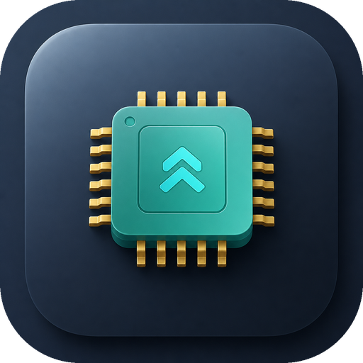
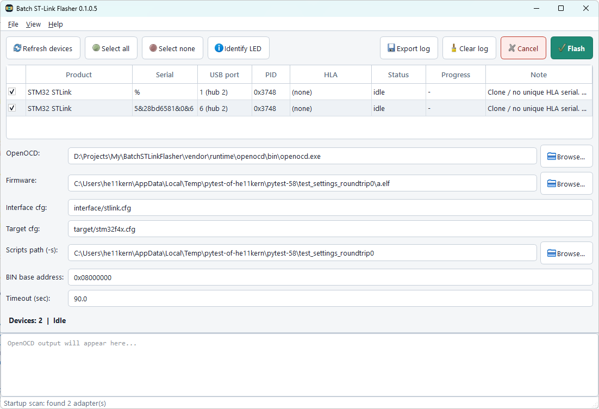

<p align="center">
  
</p>

<h1 align="center">Batch ST-Link Flasher</h1>

<p align="center">
  <strong>Flash the same firmware to many STM32 boards at once</strong><br>
  One OpenOCD process per ST-Link · HLA parallel · clone-safe sequential isolation
</p>

<p align="center">
  <a href="https://github.com/T-REX-XP/BatchSTLinkFlasher/actions/workflows/ci.yml"></a>
  <a href="https://github.com/T-REX-XP/BatchSTLinkFlasher/blob/main/LICENSE"></a>
  
  
  
  
  
</p>

<p align="center">
  <a href="#features">Features</a> ·
  <a href="#screenshots">Screenshots</a> ·
  <a href="#quick-start">Quick start</a> ·
  <a href="#operator-flow">Operator flow</a> ·
  <a href="#build--package">Build</a> ·
  <a href="#documentation">Docs</a>
</p>

---

<p align="center">
  
</p>

<p align="center"><em>Main window: multi-adapter table, USB port column, Identify LED, flash config, and session log.</em></p>

## Why this exists

Factory and lab setups often flash **many identical boards** with **one ST-Link each**.
OpenOCD can pin genuine probes with `hla_serial`, but cheap clones often share a
placeholder serial (`%`). This app handles both:

| Probe | Strategy |
|-------|----------|
| Unique HLA serial | **Parallel** — one OpenOCD per adapter |
| Clone / no HLA | **Sequential** + Windows USB isolation |

Details and diagrams: [docs/dual-flash-strategy.md](docs/dual-flash-strategy.md).

## Features

- Discover ST-Links via Windows PnP (optional `st-info` / pyusb)
- Device table with serial, VID/PID, **USB port / hub**, HLA status
- **Identify LED** — blink a probe’s COM LED to find it in a cable bundle
- Dual flash strategy (HLA parallel / clone isolation)
- Live per-device logs, progress, cancel, text/JSON export
- Themes: System · Light · Dark
- Packaged Windows app with **bundled OpenOCD**

## Screenshots

| Main UI |
|:-------:|
|  |

App icon / About artwork: `docs/imgs/logo.png`

## Quick start

**Developers**

```powershell
powershell -ExecutionPolicy Bypass -File scripts\install_build_deps.ps1
.\.venv\Scripts\activate
python -m batch_stlink_flasher
```

**From a venv manually**

```bash
python -m venv .venv
.venv\Scripts\activate
pip install -e ".[dev]"
pytest
python -m batch_stlink_flasher
```

| Shortcut | Action |
|----------|--------|
| `Ctrl+Return` | Start flash |
| `Esc` | Cancel |
| `Ctrl+S` | Export log |
| `F5` | Refresh devices |

## Prerequisites

| Audience | Needs |
|----------|--------|
| **Developers** | Windows 10/11, Python 3.11+, optional OpenOCD on `PATH` |
| **Operators** | Windows 10/11; no system Python; OpenOCD bundled by `build_installer.ps1`; optional ST USB driver |

Identify LED and clone isolation may require **Run as administrator** if Windows blocks device disable.

## Operator flow

1. Plug in ST-Links — splash scans, or click **Refresh devices**.
2. Map rows with the **USB port** column and/or **Identify LED**.
3. Choose firmware (`.elf` / `.hex` / `.bin`) and OpenOCD interface + target scripts.
4. Check adapters → **Flash**.
5. Watch per-device status; **Cancel** or export the session log if needed.

## Build & package

Produces **`BatchSTLinkFlasher.exe`** (onedir) and a single **`…-Setup.exe`** installer:

```powershell
powershell -ExecutionPolicy Bypass -File scripts\install_build_deps.ps1 -InstallSystemDeps
powershell -ExecutionPolicy Bypass -File scripts\build_app.ps1
powershell -ExecutionPolicy Bypass -File scripts\build_installer.ps1 -InstallInno -ZipPortable
```

One-shot: `scripts\build_all.ps1 -ZipPortable -InstallSystemDeps -InstallInno`

| Output | Path |
|--------|------|
| App EXE | `dist\BatchSTLinkFlasher\BatchSTLinkFlasher.exe` |
| Installer | `dist\BatchSTLinkFlasher-<ver>-Setup.exe` |
| Portable zip | `dist\BatchSTLinkFlasher-<ver>-portable.zip` (optional) |

**Setup.exe** needs [Inno Setup 6](https://jrsoftware.org/isdl.php). Use `-InstallInno` or
`winget install JRSoftware.InnoSetup`. Details: [docs/packaging.md](docs/packaging.md).

Version source: `packaging/version.json` (build bumps on each `build_app.ps1` run).

## Documentation

| Document | Description |
|----------|-------------|
| [docs/requirements.md](docs/requirements.md) | Product contract (`FR-*` / `NFR-*`) |
| [docs/architecture.md](docs/architecture.md) | Modules & threading |
| [docs/dual-flash-strategy.md](docs/dual-flash-strategy.md) | Parallel HLA + sequential clones |
| [docs/stlink-clone-serial.md](docs/stlink-clone-serial.md) | Clone USB serial conflicts, recovery repos |
| [docs/openocd-integration.md](docs/openocd-integration.md) | OpenOCD CLI, ports, serials |
| [docs/packaging.md](docs/packaging.md) | Build / installer / GitHub Release |
| [docs/plan.md](docs/plan.md) | Implementation phases |
| [scripts/README.md](scripts/README.md) | Packaging scripts |
| [AGENTS.md](AGENTS.md) | AI agent working rules |
| [CHANGELOG.md](CHANGELOG.md) | Release notes |

Images for this README live in [`docs/imgs/`](docs/imgs/).

## Status

Phases **0–6** complete (docs → discovery → flash → orchestrator → UI → packaging).
Remaining items are **operator hardware** checklists in [docs/plan.md](docs/plan.md).

## License

[MIT](LICENSE)
