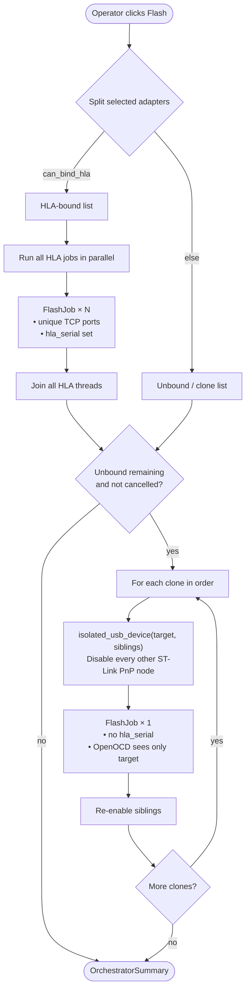
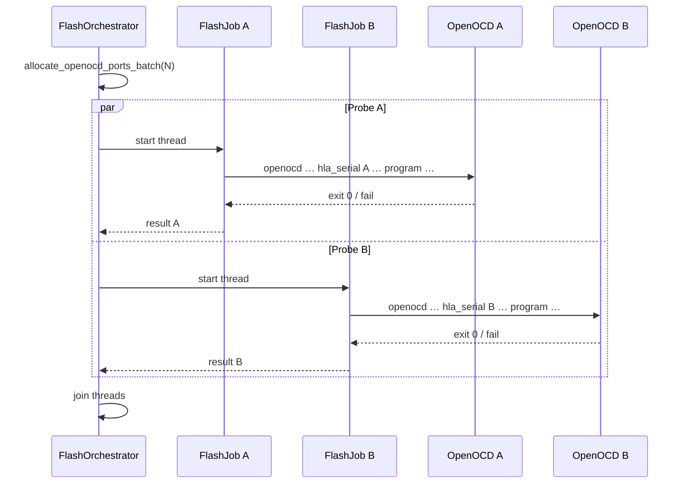
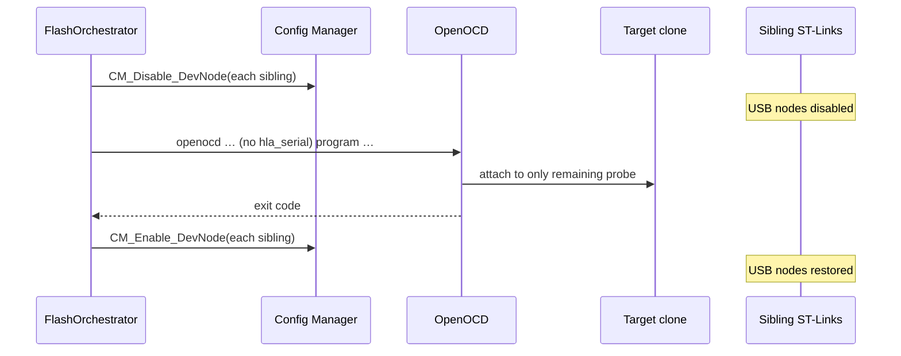

# Dual flash strategy

How Batch ST-Link Flasher flashes **several ST-Link programmers at once** when
some probes have unique HLA serials and others are cheap clones that do not.

**Related:** `docs/openocd-integration.md` (CLI / ports), `docs/architecture.md`
(modules), `docs/stlink-clone-serial.md` (making clones unique via firmware),
`FR-FLASH-03` in `docs/requirements.md`.

---

## 1. Why two modes?

OpenOCD talks to ST-Link over USB using the **HLA** (High-Level Adapter) layer.
When more than one ST-Link is plugged in, OpenOCD must be told **which** probe
to open. That is done with:

```text
-c hla_serial "…"
```

| Probe | Typical serial | Can OpenOCD pin it? |
|-------|----------------|---------------------|
| Genuine ST-Link / unique iSerial | Hex / `\xNN…` | **Yes** → safe **parallel** flash |
| Many clones | Placeholder `%`, or Windows invents `5&…` | **No** → OpenOCD would grab an arbitrary probe |

If two clones both lack a usable `hla_serial`, starting two OpenOCD processes
at once races: both may attach to the same dongle, or the wrong target.

**Solution:** classify each selected adapter, then run:

1. **HLA-bound** adapters → **parallel** (one OpenOCD each, with `hla_serial`).
2. **Unbound clones** → **sequential**, with **Windows USB isolation** so only
   one ST-Link remains enabled while that OpenOCD runs **without** `hla_serial`.

---

## 2. Classification

Implemented in `FlashOrchestrator` via `can_bind_hla(adapter)`:

```text
multi_adapter_ok == true  AND  hla_serial is non-empty
        ↓
   HLA-bound (parallel)
        else
   unbound / clone (sequential + isolation)
```

Discovery fills `AdapterInfo`:

| Field | Role |
|-------|------|
| `serial` | Display / log id (`%`, Windows instance suffix, or real serial) |
| `hla_serial` | Value passed to OpenOCD (empty when not bindable) |
| `multi_adapter_ok` | `true` when discovery believes HLA binding is safe |
| `usb_path` | Full PnP instance id (`USB\VID_0483&PID_3748\…`) — **required** for clone isolation |

Clones that share display serial `%` are distinguished by `usb_path` (and by
orchestrator job keys `index:serial:usb_path`).

---

## 3. End-to-end flow



**Order matters:** HLA probes finish first (true parallel), then clones run
one-by-one. Mixed selections are supported.

---

## 4. Parallel path (originals / unique serial)



Properties:

- One OpenOCD **process per** adapter (never share a process across probes).
- Unique `gdb_port` / `telnet_port` / `tcl_port` triples (see openocd-integration).
- Failures are isolated per job; one bad cable does not stop siblings.

---

## 5. Sequential path (clones + USB isolation)

When OpenOCD cannot pin a probe, the app temporarily makes the target the
**only enabled ST-Link** on the machine (among known discovery results).



Isolation helper: `services/windows_device_control.py` → `isolated_usb_device`.

```text
siblings = known_adapters[].usb_path  (all discovered ST-Links)
target   = adapter.usb_path

for each sibling ≠ target:
    CM_Disable_DevNode(sibling)     # fail → DeviceIsolationError
run FlashJob (no hla_serial)
finally:
    CM_Enable_DevNode(every disabled sibling)
```

### Isolation timeline (two clones)

```text
 time →
 Clone1:  [==== disable siblings ====][==== flash ====][== re-enable ==]
 Clone2:                                                   [==== disable ====][==== flash ====][== re-enable ==]
 HLA A/B: [======== parallel flash (already done) ========]
```

---

## 6. Module map


| Module | Responsibility |
|--------|----------------|
| `flashing/orchestrator.py` | Split bound/unbound; parallel then sequential |
| `flashing/job.py` | Run one OpenOCD job, stream logs, timeouts |
| `flashing/openocd.py` | Build argv (`hla_serial` only when set) |
| `services/windows_device_control.py` | Disable/enable PnP nodes |
| `services/windows_pnp.py` / `device_service.py` | Discovery → `AdapterInfo` + `usb_path` |

Identify LED reuses the same disable/enable APIs to blink the COM LED
(see openocd-integration).

---

## 7. Operator view

| Selection | What happens |
|-----------|----------------|
| 1+ unique-serial only | All flash together |
| 1+ clones only | One after another; others briefly disappear from Device Manager |
| Mix | Unique-serial group first (parallel), then each clone |
| Clone without `usb_path` | Row fails: cannot isolate |
| Disable denied by Windows | Job fails — try **Run as administrator**, unplug extras, or use unique-serial probes |

**Factory recommendation:** buy / program ST-Links with unique USB serials so
the whole batch stays in the parallel path (faster, no elevation, no Device
Manager flicker).

---

## 8. Failure modes

| Symptom | Cause | Mitigation |
|---------|--------|------------|
| Two clones selected, both flash the same board | Isolation skipped / failed | Ensure `usb_path` present; elevate; check Device Manager |
| `could not disable sibling ST-Link` | Permissions / driver holds node | Elevate app; close STM32CubeProgrammer / other OpenOCD |
| Sibling stays disabled after crash | Rare enable failure | Re-enable in Device Manager or unplug/replug |
| Parallel job opens wrong probe | Bad / empty `hla_serial` | Fix discovery / HLA normalization |

Cancel: HLA threads are cancelled; remaining sequential clones are skipped
(`cancelled before start`).

---

## 9. Code entry points

```text
FlashOrchestrator.run()
  └─ _execute()
       ├─ bound   → _run_parallel()
       └─ unbound → _run_sequential_isolated()
              └─ isolated_usb_device(target, sibling_ids)
                     └─ FlashJob.run()   # no hla_serial
```

Tests: `tests/test_orchestrator.py` (and related) cover split behavior with
mocked isolation / jobs.
